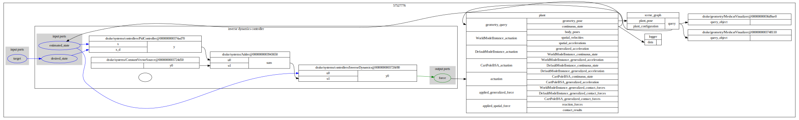
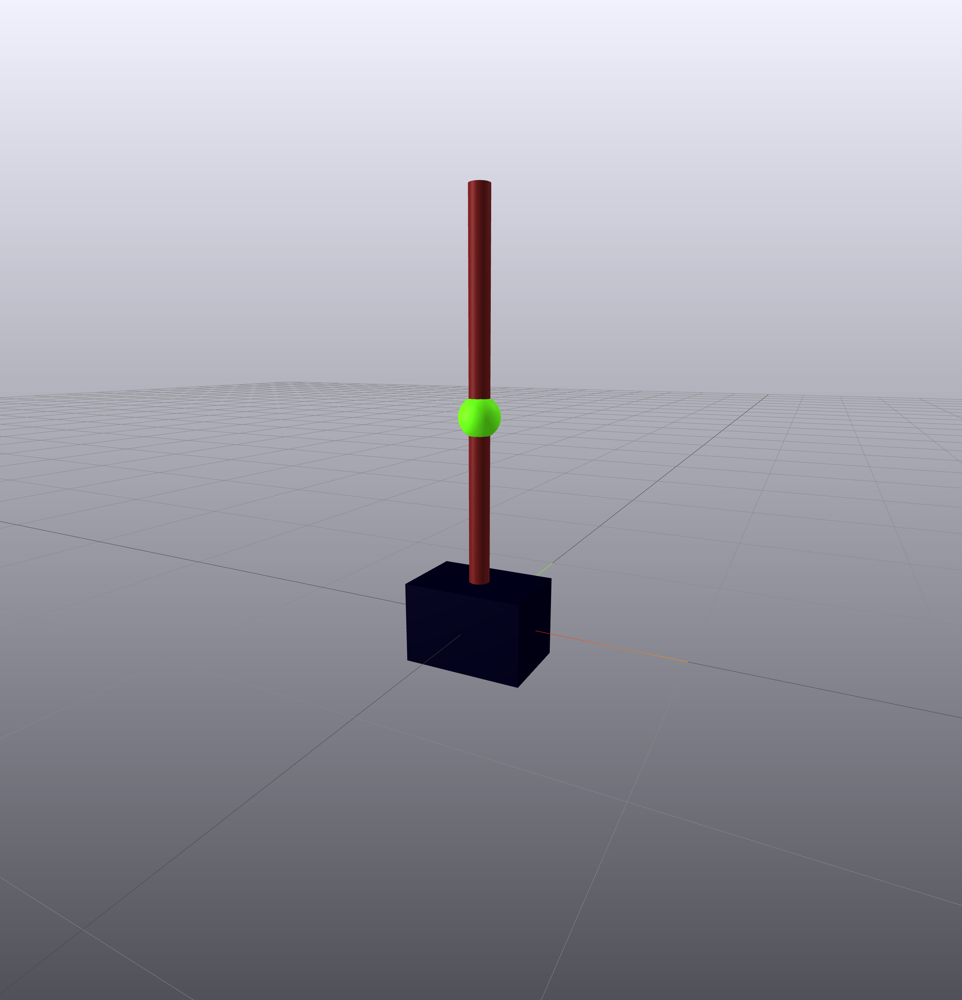
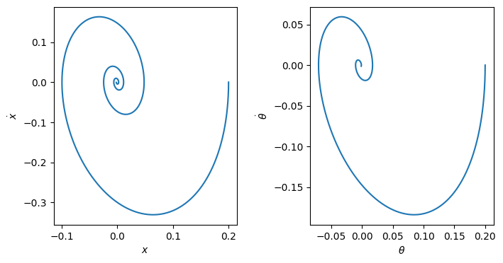

### Environment
- Ubuntu 20.04 x86-64
- venv with Python 3.8.10
    - `python3 -m venv drake`
    - `source drake/bin/activate`
- Drake is installed using `pip install drake==1.9.0`
    - also followed instructions in [the official documents](https://drake.mit.edu/pip.html#stable-releases) 
- Jupyter notebook is installed separately.
    - `pip install notebook`
- `imageio` is used to create a gif file below.
    - `pip install imageio`

### Cloning a repository
- `git clone git@github.com:jojo978/drake.git`
  - since you are reading this document, cloning must be done already. 

### System structure

1. `MultibodyPlant` for a Cart-Pole
   - fully-actuated (2 actuation)
   - loaded from an SDF file `cartpole_BSA.sdf`
2. Inverse dynamics controller
    - since two joints are coupled, an inverse dynamics controller may perform better than two decoupled PID controllers.
    - `pydrake.systems.controllers.InverseDynamicsController`
    - PID parameters are tune by some trial and error
        - but I'm not sure if these parameters are optimal in some sense.
        - two actuators has limited output but controller doesn't take this limit into account
          - you might see quite unexpected behaviors
3. `LogVectorOutput` for plotting
   - two phase space plots are generated
4. `SceneGraph` and two visualizers
   - for realtime visualization and recordings

### Visualization
- Meshcat for realtime visualization and recording
- a snapshot below is taken at t = 10 sec, when the system is almost stabilized.

### Run
- start a Jupyter server
    - `jupyter notebook`
- open the notebook and run `cartpole_balancing_inverse_dynamics.ipynb`

### Simulation
- the initial state of the Cart-Pole is chosen to be (0.2, 0.2, 0.0, 0.0) at t = 0
- the target state is the quiescent state at the origin (0.0, 0.0, 0.0, 0.0), which is a unstable equilibrium.
- simulated up to t = 10 sec

### Simulation results
- for this particular initial state and PID parameters, the simulation shows a stabilizing behavior
- trajectories in the phase space 

- video recoding from 0 sec to 10 sec 

